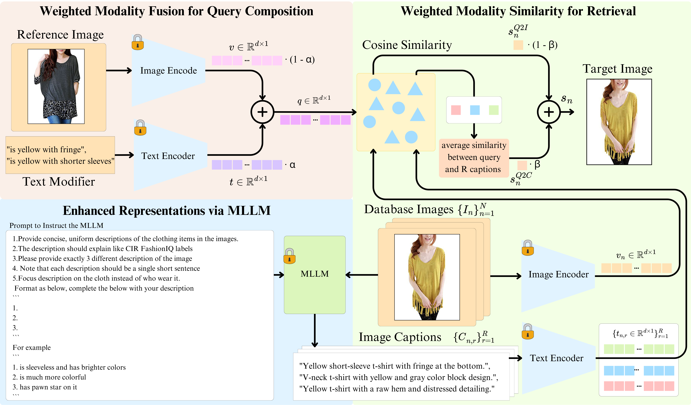

<div align="center">

# WeiMoCIR

The official implementation for:

Training-free Zero-shot Composed Image Retrieval via Weighted Modality Fusion and Similarity

##

[](https://arxiv.org/abs/2409.04918)
[](https://github.com/whats2000/WeiMoCIR/blob/main/LICENSE)
	
[](https://paperswithcode.com/sota/zero-shot-composed-image-retrieval-zs-cir-on-2?p=training-free-zs-cir-via-weighted-modality)

[](https://paperswithcode.com/sota/zero-shot-composed-image-retrieval-zs-cir-on-1?p=training-free-zs-cir-via-weighted-modality)
</div>

## Introduction

We introduce a training-free approach for ZS-CIR. 

Our approach, Weighted Modality fusion and similarity for CIR (WeiMoCIR),
operates under the assumption that image and text modalities can be effectively combined using a simple weighted average. 
This allows the query representation to be constructed directly from the reference image and text modifier. 

To further enhance retrieval performance,
we employ multimodal large language models (MLLMs)
to generate image captions for the database images
and incorporate these textual captions into the similarity computation
by combining them with image information using a weighted average.

Our approach is simple, easy to implement,
and its effectiveness is validated through experiments on the FashionIQ and CIRR datasets

<details>
  <summary>Click to see the details</summary>

Overview of the proposed WeiMoCIR, a training-free approach for zero-shot composed image retrieval (ZS-CIR).

Leveraging pretrained VLMs and MLLMs, our method comprises three modules: 
- Weighted Modality Fusion for Query Composition
- Enhanced Representations through MLLM-generated image captions
- Weighted Modality Similarity, which integrates both query-to-image and query-to-caption similarities for retrieval.


</details>

## Setting up

First, clone the repository to a desired location.

<details>
  <summary><b>Prerequisites</b></summary>
&emsp; 
	
The following commands will create a local Anaconda environment with the necessary packages installed.

```bash
conda create -n wei_mo_cir -y python=3.8
conda activate wei_mo_cir
pip install -r requirements.txt
pip install git+https://github.com/openai/CLIP.git
export PYTHONPATH=$(pwd)
```

&emsp; 
</details>

<details>
  <summary><b>Download Pre-trained Weight</b></summary>
&emsp; 

We use these pre-trained models BLIP w/ ViT-B. For BLIP checkpoint download, please refer to the following links:
- [BLIP w/ ViT-B (129M)](https://github.com/salesforce/BLIP?tab=readme-ov-file#pre-trained-checkpoints)
- [BLIP w/ ViT-B fine tuned on Image-Text Retrieval (COCO)](https://github.com/salesforce/BLIP?tab=readme-ov-file#finetuned-checkpoints)
- [BLIP w/ ViT-B fine tuned on Image-Text Retrieval (Flickr30k)](https://github.com/salesforce/BLIP?tab=readme-ov-file#finetuned-checkpoints)
- [BLIP w/ ViT-L (129M)](https://github.com/salesforce/BLIP?tab=readme-ov-file#pre-trained-checkpoints)
- [BLIP w/ ViT-L fine tuned on Image-Text Retrieval (COCO)](https://github.com/salesforce/BLIP?tab=readme-ov-file#pre-trained-checkpoints)
- [BLIP w/ ViT-L fine tuned on Image-Text Retrieval (Flickr30k)](https://github.com/salesforce/BLIP?tab=readme-ov-file#pre-trained-checkpoints)

For the CLIP model, you will download the model from the Hugging Face model hub. So you don't need to download the model manually.

Here is the link to each model:
- [CLIP-ViT-B-32](https://huggingface.co/laion/CLIP-ViT-B-32-laion2B-s34B-b79K): laion/CLIP-ViT-B-32-laion2B-s34B-b79K
- [CLIP-ViT-L-14](https://huggingface.co/laion/CLIP-ViT-L-14-laion2B-s32B-b82K): laion/CLIP-ViT-L-14-laion2B-s32B-b82K
- [CLIP-ViT-H-14](https://huggingface.co/laion/CLIP-ViT-H-14-laion2B-s32B-b79K): laion/CLIP-ViT-H-14-laion2B-s32B-b79K
- [CLIP-ViT-G-14](https://huggingface.co/Geonmo/CLIP-Giga-config-fixed): Geonmo/CLIP-Giga-config-fixed
- [CLIP-ViT-G-14](https://huggingface.co/laion/CLIP-ViT-bigG-14-laion2B-39B-b160k): laion/CLIP-ViT-bigG-14-laion2B-39B-b160k (At this moment the config file is already fixed, the results will be identical to Geonmo/CLIP-Giga-config-fixed)

The download BLIP model should be placed in the `models` folder.
```angular2html
models/
    model_base.pth
    model_base_retrieval_coco.pth
    model_base_retrieval_flickr.pth
    model_large.pth
    model_large_retrieval_coco.pth
    model_large_retrieval_flickr.pth
```
&emsp;
</details>

<details>
  <summary><b>FashionIQ Dataset</b></summary>
&emsp;

The FashionIQ dataset can be downloaded from the following link:
- [Fashion-IQ](https://github.com/XiaoxiaoGuo/fashion-iq)

The dataset should be placed in the `fashionIQ_dataset` folder.
```angular2html
fashionIQ_dataset/
    labeled_images_cir_cleaned.json
    captions/
        cap.dress.test.json
        cap.dress.train.json
        cap.dress.val.json
        ...
    image_splits/
        split.dress.test.json
        split.dress.train.json
        split.dress.val.json
        ...
    images/
        245600258X.png
        978980539X.png
        ...
```
&emsp;
</details>

<details>
  <summary><b>CIRR Dataset</b></summary>
&emsp;

The CIRR dataset can be downloaded from the following link:
- [CIRR](https://github.com/Cuberick-Orion/CIRR)

The dataset should be placed in the `cirr_dataset` folder.
```angular2html
cirr_dataset/
    train/
        0/
            train-10108-0-img0.png
            train-10108-0-img1.png
            train-10108-1-img0.png
            ...
        1/
            train-10056-0-img0.png
            train-10056-0-img1.png
            train-10056-1-img0.png
            ...
        ...
    dev/
        dev-0-0-img0.png
        dev-0-0-img1.png
        dev-0-1-img0.png
        ...
    test1/
        test1-0-0-img0.png
        test1-0-0-img1.png
        test1-0-1-img0.png
        ...
    cirr/
        captions/
            cap.rc2.test1.json
            cap.rc2.train.json
            cap.rc2.val.json
        image_splits/
            split.rc2.test1.json
            split.rc2.train.json
            split.rc2.val.json
```
&emsp;
</details>

> [!NOTE]  
> 1. Please modify the `requirements.txt` file if you use a different version of torch with different CUDA version.
> 2. Make sure change the `PYTHONPATH` to the current directory. Or the code will not be able to find the necessary modules.

## Code breakdown

Our code is based on the validation script of the [Bi-BlipCIR](https://github.com/Cuberick-Orion/Bi-Blip4CIR/) repository.

The main differences are:
- We modified the elements wide sum with additional weight `alpha`. For weighted the text and image features.
- We use MLLM to generate the image captions and use it as the text features for index image.
- We calculate the additional distance between the merge query feature and the MLLM text descriptions for index image. And then use mean of the text distances as the index text feature.
- Finally, we combine the index image feature and index text feature with the weight `beta` for the final retrieval candidate.

The main code changes are in the `src/validate.py`, `src/validate_clip.py` and `src/utils.py` files.

## Reproducing results

### For benchmark evaluation

<details>
  <summary><b>For FashionIQ dataset</b></summary>

Reproducing the results of the BLIP VIT-B models and BLIP VIT-L models,
You can check out these checkpoints
- models/model_base.pth
- models/model_base_retrieval_coco.pth
- models/model_base_retrieval_flickr.pth
- models/model_large.pth
- models/model_large_retrieval_coco.pth
- models/model_large_retrieval_flickr.pth

For example, to reproduce the results in Ablation Study with the BLIP with retrieval training on COCO dataset:
```bash
python src/validate.py --dataset fashionIQ \
                       --blip-pretrained-path models/model_base_retrieval_coco.pth \
                       --combining-function sum \
                       --text_captions_path fashionIQ_dataset/labeled_images_cir_cleaned.json \
                       --blip-vit base \
                       --alpha 0.95 --beta 0.2
```

>[!NOTE]
> You should change the `--blip-vit` into `large` for the BLIP VIT-L models.

Reproducing the results of the CLIP models
You can change the clip_name into below for the results in CLIP
- VIT-B32: laion/CLIP-ViT-B-32-laion2B-s34B-b79K
- VIT-L14: laion/CLIP-ViT-L-14-laion2B-s32B-b82K
- VIT-H14: laion/CLIP-ViT-H-14-laion2B-s32B-b79K
- VIT-G14: laion/CLIP-ViT-bigG-14-laion2B-39B-b160k
```bash
python src/validate_clip.py --dataset FashionIQ \
                            --clip_name laion/CLIP-ViT-bigG-14-laion2B-39B-b160k \
                            --text_captions_path fashionIQ_dataset/labeled_images_cir_cleaned.json \
                            --alpha 0.8 --beta 0.1 
```

</details>

<details>
  <summary><b>For CIRR dataset</b></summary>

Reproducing the results of the BLIP VIT-B models and BLIP VIT-L models,
Similar to the FashionIQ dataset, you can check out these checkpoints
- models/model_base.pth
- models/model_base_retrieval_coco.pth
- models/model_base_retrieval_flickr.pth
- models/model_large.pth
- models/model_large_retrieval_coco.pth
- models/model_large_retrieval_flickr.pth

For example, to reproduce the results of the BLIP with retrieval training on COCO dataset:
```bash
python src/cirr_test_submission.py --submission-name submit_blip_vit_base_coco \
                                   --combining-function sum \
                                   --blip-pretrained-path models/model_base_retrieval_coco.pth \
                                   --text_captions_path cirr_dataset/cirr_labeled_images_cir_cleaned.json \
                                   --blip-vit base \
                                   --alpha 0.95 --beta 0.2
```

>[!NOTE]
> You should change the `--blip-vit` into `large` for the BLIP VIT-L models.

Reproducing the results of the CLIP models,
You can change the clip_name into below for the results in CLIP
- VIT-B32: laion/CLIP-ViT-B-32-laion2B-s34B-b79K
- VIT-L14: laion/CLIP-ViT-L-14-laion2B-s32B-b82K
- VIT-H14: laion/CLIP-ViT-H-14-laion2B-s32B-b79K
- VIT-G14: laion/CLIP-ViT-bigG-14-laion2B-39B-b160k

For example, to reproduce the results of the CLIP with CLIP ViT L/14:
```bash
python src/cirr_test_submission_clip.py --submission-name submit_clip_vit_l \
                                    --combining-function sum \
                                    --clip_name laion/CLIP-ViT-L-14-laion2B-s32B-b82K \
                                    --text_captions_path cirr_dataset/cirr_labeled_images_cir_cleaned.json \
                                    --alpha 0.8 --beta 0.1
```

</details>

### For other experiments

The experiments are divided into three folders:
- `src/ablation_experiment/`: This folder contains the code for the ablation experiment.
- `src/cirr_experiment/`: This folder contains the code for the CIRR dataset experiment.
- `src/fashioniq_experiment/`: This folder contains the code for the FashionIQ dataset experiment.

Feel free to explore the code and run the experiments.

## License

We use the same MIT License as the [Bi-BlipCIR](https://github.com/Cuberick-Orion/Bi-Blip4CIR/), [CLIP4Cir](https://github.com/ABaldrati/CLIP4Cir/blob/master/LICENSE) and [BLIP](https://github.com/salesforce/BLIP/blob/main/LICENSE.txt).

## Citation

Special thanks to the [Bi-BlipCIR](https://github.com/Cuberick-Orion/Bi-Blip4CIR/).
We use the code to evaluate the performance of our proposed method. 
If you find this code useful for your research, please consider citing the original paper:
```bibtex
@misc{wu2024trainingfreezeroshotcomposedimage,
      title={Training-free Zero-shot Composed Image Retrieval via Weighted Modality Fusion and Similarity}, 
      author={Ren-Di Wu and Yu-Yen Lin and Huei-Fang Yang},
      year={2024},
      eprint={2409.04918},
      archivePrefix={arXiv},
      primaryClass={cs.CV},
      url={https://arxiv.org/abs/2409.04918}, 
}
```
